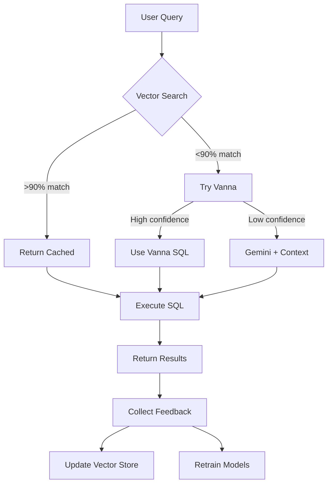

# CLAUDE.md - FF_Agent Development Guide

## 🤖 For Future AI Assistants

This document helps AI assistants understand and work with the FF_Agent codebase effectively.

## 📚 System Versions

FF_Agent has **TWO versions** that coexist:

### Version 1: Basic System
- **Start with**: `./start.sh`
- **API**: `api.py` or `api_with_pooling.py`
- **Purpose**: Simple, fast, minimal dependencies
- **Use for**: Quick tests, development

### Version 2: Integrated System
- **Start with**: `./start_integrated_system.sh`
- **API**: `api_integrated.py`
- **Purpose**: Full AI integration with learning
- **Use for**: Production, complex queries

**See `docs/VERSIONS.md` for detailed comparison**

## 🏗️ Architecture Overview

### Core Components
1. **API Layer** (Port 8000)
   - Basic: `api.py` (Gemini only)
   - Integrated: `api_integrated.py` (Vanna + Vector + Gemini)

2. **UI Layer** (Port 3000)
   - `ui/index.html` - React-based interface
   - Works with both API versions

3. **AI Components**
   - `ff_agent_vanna.py` - Vanna AI model
   - `vector_store_cached.py` - Vector similarity search
   - `feedback_system.py` - Learning from user feedback

4. **Database**
   - PostgreSQL (Neon) for main data
   - ChromaDB for vector embeddings
   - SQLite for Vanna model storage

## 🚀 Common Tasks

### Starting the System
```bash
# Version 1 (Simple)
./start.sh

# Version 2 (Integrated)
./start_integrated_system.sh
```

### Testing Queries
```bash
# Test basic API
curl -X POST http://localhost:8000/query \
  -H "Content-Type: application/json" \
  -d '{"question": "How many drops are there?"}'

# Test with integrated features (V2 only)
curl -X POST http://localhost:8000/query \
  -H "Content-Type: application/json" \
  -d '{"question": "How many drops?", "use_vector_search": true, "use_vanna": true}'
```

### Adding New Query Patterns
```python
# For Version 2 - patterns are learned automatically
# Manual addition:
from vector_store_cached import CachedVectorStore
store = CachedVectorStore()
store.add_pattern(
    question="Your question",
    sql="SELECT ...",
    metadata={"source": "manual"}
)
```

## 📂 Project Structure

```
FF_Agent/
├── api.py                    # V1: Basic API
├── api_integrated.py         # V2: Integrated API
├── api_with_pooling.py      # V1: With connection pooling
├── start.sh                 # V1: Startup script
├── start_integrated_system.sh # V2: Startup script
├── ui/
│   └── index.html           # Web interface (both versions)
├── docs/
│   └── VERSIONS.md          # Version comparison guide
├── feedback_system.py       # V2: User feedback collection
├── vector_store_cached.py   # V2: Vector search
├── ff_agent_vanna.py        # V2: Vanna AI model
└── vanna_chroma/            # V2: Model storage
```

## 🔧 Environment Variables

Required for both versions:
```bash
DATABASE_URL=postgresql://...  # Neon database
GOOGLE_API_KEY=...             # Gemini API key
```

Optional for Version 2:
```bash
VANNA_API_KEY=...              # If using Vanna cloud
```

## 🧪 Testing & Quality

### Linting (if user provides command)
```bash
# Python
ruff check .
mypy .

# JavaScript (in UI)
npm run lint
```

### Running Tests
```bash
# Test integration (V2)
python test_integration.py

# Test basic functionality (V1)
python test_simple_query.py
```

## 🐛 Common Issues & Solutions

### Issue: "Module not found"
**Solution**: Install dependencies
```bash
pip install -r requirements.txt
# For V2 specifically:
pip install vanna chromadb psycopg2-binary
```

### Issue: "Port already in use"
**Solution**: Kill existing processes
```bash
pkill -f "python api"
pkill -f "http.server 3000"
```

### Issue: "Vector store not initialized"
**Solution**: Run setup
```bash
python setup_vector_rag.py
```

## 📈 Performance Optimization

### For Version 1
- Use `api_with_pooling.py` for better connection management
- Add caching with Redis if needed

### For Version 2
- Vector cache is automatic
- Tune confidence thresholds in `api_integrated.py`
- Monitor feedback stats at `/stats` endpoint

## 🎯 Development Guidelines

1. **Preserve both versions** - They serve different purposes
2. **Test changes** - Run `test_integration.py` after changes
3. **Document patterns** - Add successful queries to vector store
4. **Monitor feedback** - Check feedback_data/ for user corrections
5. **Keep UI compatible** - Must work with both API versions

## 📝 Query Flow (Version 2)



## 🔄 Continuous Improvement

The system learns from:
1. **Successful queries** - Automatically added to vector store
2. **User feedback** - 👍/👎 buttons in UI
3. **Corrections** - User-provided SQL improvements
4. **Query patterns** - Frequently asked questions

## 🚨 Important Notes

- **Version 1 is NOT deprecated** - It's the simple/stable version
- **Version 2 is NOT experimental** - It's production-ready
- **Both share the same database** - No data duplication
- **UI works with both** - Automatically adapts to API version

## 📊 Monitoring

### Check System Health
```bash
# Version 1
curl http://localhost:8000/stats

# Version 2 (more detailed)
curl http://localhost:8000/health
curl http://localhost:8000/stats
```

### View Logs
```bash
# Feedback logs (V2)
tail -f feedback_data/queries.jsonl

# API logs
# Shown in terminal when running start scripts
```

## 🤝 Contributing

When adding features:
1. Decide if it's for V1 (simple) or V2 (integrated)
2. Update appropriate API file
3. Ensure UI remains compatible
4. Update this document if needed
5. Test both versions still work

---

**Last Updated**: August 22, 2025
**Current Production Version**: V2 (Integrated)
**Stable Fallback**: V1 (Basic)